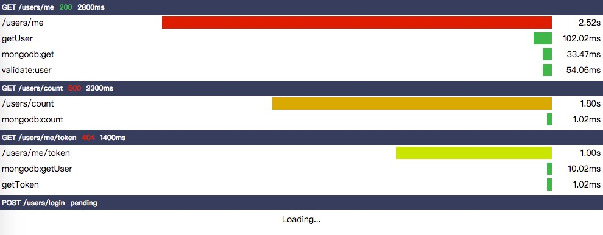

# http-timing

Generate the http timing(Server-Timing)

[](https://travis-ci.org/vicanso/http-timing)
[](https://coveralls.io/r/vicanso/http-timing?branch=master)
[](https://www.npmjs.org/package/http-timing)
[](https://github.com/vicanso/http-timing)



## API

### Constructor

The HTTPTiming constructor

- `options` The constructor options
  - `options.max` The max time(ms), use for the time line bar, default is 10 * 1000
  - `options.size` The cache size, default is 10

```js
const HTTPTiming = require('http-timing);
const httpTiming = new HTTPTiming({
  max: 5 * 1000,
  size: 5,
});
```

### add

Add the data to timing view

- `data` The setting of http timing
  - `data.url` The http request url
  - `data.method` The http request method
  - `data.status` The http response status
  - `data.use` The http response time
  - `data.serverTiming` The http server timing

```js
const HTTPTiming = require('http-timing);
const httpTiming = new HTTPTiming();
httpTiming.add({
  method: 'GET',
  url: '/users/me',
  status: 200,
  use: 3000,
  serverTiming: 'A=2521.46147;"/users/me",B=102.022688;"getUser",C=33.468153;"mongodb:get",D=54.064163;"validate:user"',
});
```

### length

Get the cache length

```js
const HTTPTiming = require('http-timing);
const httpTiming = new HTTPTiming();
// 0
console.info(httpTiming.length);
```

### empty

Remove all cache

```js
const HTTPTiming = require('http-timing);
const httpTiming = new HTTPTiming();
httpTiming.add({
  method: 'GET',
  url: '/users/me',
  status: 200,
  use: 3000,
  serverTiming: 'A=2521.46147;"/users/me",B=102.022688;"getUser",C=33.468153;"mongodb:get",D=54.064163;"validate:user"',
});
// 1
console.info(httpTiming.length)
httpTiming.empty();
// 0
console.info(httpTiming.length)
```

### toHTML

Get the html of http timing

```js
const HTTPTiming = require('http-timing);
const httpTiming = new HTTPTiming();
httpTiming.add({
  method: 'GET',
  url: '/users/me',
  status: 200,
  use: 3000,
  serverTiming: 'A=2521.46147;"/users/me",B=102.022688;"getUser",C=33.468153;"mongodb:get",D=54.064163;"validate:user"',
});
const html = httpTiming.toHTML();
console.info(html);
```

## License

MIT